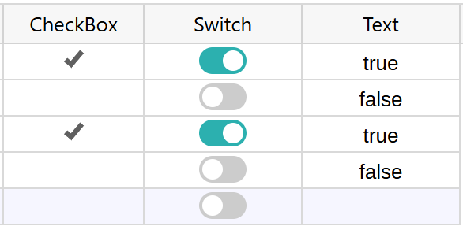
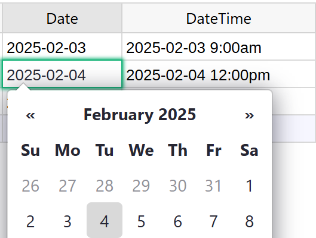
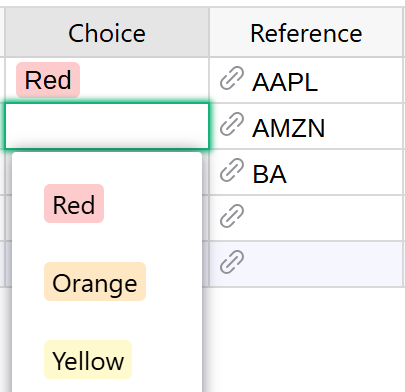

# Entering data

A spreadsheet-like grid is a great way to see data. In Grist, this is the view
offered by the default page widget called "Table".

As in a spreadsheet, you can use the mouse or arrow keys to move around the
cells of a table. To start entering data into a selecte cell, either start
typing, hit <code class="keys">*Enter*</code>, or double-click the cell.

## Editing cells

While editing a cell, several keys are special:

 * <code class="keys">*Escape*</code> cancels the operation and restores the previous value in the cell.
 * <code class="keys">*Tab*</code>, <code class="keys">*Shift* + *Tab*</code>
   saves your entry and moves your cursor to the next or previous cell.
 * <code class="keys">*Enter*</code> saves your entry and moves your cursor to the next row.
 * <code class="keys">*Shift* + *Enter*</code> adds a newline inside your cell.

## Copying and pasting

You can copy data from Grist or paste data into it. If the pasted range is
longer than the available records, new records will be added.

Note that Grist does not create new columns automatically. If the pasted data
has more columns than the grid displays, extra columns will be omitted.

## Data entry widgets

In Grist, columns have types. In addition to typing in values, many column
types offer specialized widgets for entering data more conveniently.

Here are some of the most useful ones:

- [**Toggle**](col-types.md#toggle-columns). A "Toggle" column shows True/False values, and can show
  them as a "Checkbox" or as a "Switch" widget, which you can select in the
  column options. You can toggle a value in such a cell by clicking the check
  mark or the switch, or by hitting <code class="keys">*Space*</code>.

  **
  {: .screenshot-half }

- [**Date**](col-types.md#date-columns) and [**DateTime**](col-types.md#datetime-columns). Hitting <code class="keys">*Enter*</code> on such
  a cell will open a calendar to pick a date.

  **
  {: .screenshot-half }

- [**Choice**](col-types.md#choice-columns) and [**Reference**](col-types.md#reference-columns). Typing into a cell of one of these types will produce an
  auto-complete dropdown menu.

  **
  {: .screenshot-half }

## Linking to cells

You can make a sharable link to a cell by pressing <code class="keys">*⌘* *⇧* *A*</code> (Mac)
or <code class="keys">*Ctrl* + *Shift* + *A*</code> (Windows) while the cell is selected.
This option is also available via the [row menu](widget-table.md#row-operations) as "Copy anchor link."
The link will be placed in your clipboard, ready to paste into an email or an instant messaging
app. The link will open only for people with access to the document.
